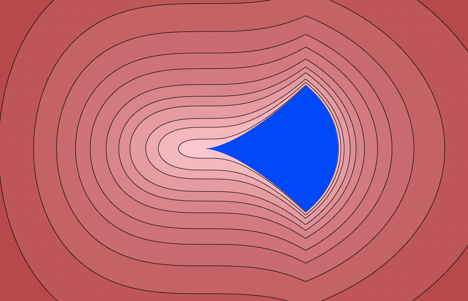

# Moment Tools

This Julia package provides tools for solving polynomial and moment optimization problems on semi-algebraic sets defined by polynomial sign and equality constraints.
In particular, it allows to optimize vectors of moments sequences that satisfy positivity constraints or mass constraints.
It is based on MoMent (MoM) and Sum-of-Squares (SOS) convex relaxations, connected to Semi-Definite Programs (SDP) solvers.
Extraction tools allow to recover the global optimizers of the problem from optimal moment sequences, using flat truncation properties.


As an illustrative example, we consider the set $S$ defined by the inequalities 
```math
\left\{\begin{array}{l}
x^3 - y^2 \ge 0\\
1 - x^2 -y^2 \ge 0
\end{array}
\right.
```
This is the blue domain below:



We want to maximize the objective function $y^2$ on this domain and to find the maximizer points. Here is how it can be done in `MomentTools`, with the SDP solver `CSDP`.

```
using MomentTools, DynamicPolynomials
using CSDP; MMT[:optimizer] = CSDP.Optimizer

X = @polyvar x y

G = [1 - x^2 - y^2, x^3-y^2 ]

f = y^2

v, M = maximize(f, [], G)

w, Xi = get_measure(M)
```
This gives the following weigts and points of the weight sum of Dirac measures  associated to the optimal moment sequence. 
```math
[
\begin{array}{cc}
0.4999999998860686 & 0.499999999867594
\end{array}
]
,

\begin{pmatrix}
0.7548776660872802 & 0.7548776660872801 \\
0.6558656173161549 & -0.6558656173161549 
\end{pmatrix}
```
These points, which are the maximizers of the optimization problem are the top and bottom "corner" points of the domain.


## Optimization

The package allows to solve optimization problems on Pseudo Moment Sequences (PMS).
A PMS is a sequence of values 
$\mu=(\mu_{\alpha})$ indexed by the monomial exponents $\alpha \in \mathbb{N}^n$ or equivalently a linear functional
$\mu: p \in \mathbb{R}[\mathbf{x}] \mapsto \langle \mu, p \rangle = \sum_{\alpha} p_{\alpha}
\mu_{\alpha}$
.
It is *positive* if for all $p\in \mathbb{R}[\mathbf{x}]$, we have 
 $\langle \mu, p^2 \rangle \geq 0$ .


Optimization problems of the following form are considered:

```math
\begin{array}{rl}
\mathrm{inf}_{\mu_i \in PMS} & \sum_i \langle f_i\star \mu_i, 1 \rangle \\
s.t. &  \sum_i g_{i,j}\star \mu_i \succeq 0, \quad j=1,\ldots, n_1 \\ 
     &  \sum_i h_{i,j}\star \mu_i = 0, \quad j=1,\ldots, n_2\\
     &  \sum_i \langle p_{i,j}\star \mu_i, 1 \rangle \ge 0 , \quad j=1,\ldots, n_3\\
     &  \sum_i \langle q_{i,j}\star \mu_i, 1 \rangle = 0, \quad j=1,\ldots, n_4 \\
\end{array}
```
where
    
-  $\mu_i$ are positive PMS,
-  $f_i, g_{i,j}, h_{i,j}, p_{i,j}, q_{i,j} \in \mathbb{R}[\mathbf{x}]$ are multivariate polynomials.

The solution of such optimization problem is approximated by the
solution of a truncated relaxation of the problem, which is a convex
optimization problem on Positive SemiDefinite matrices. Tools to
construct such moment relaxation of a given order are available in the package.

## Decomposition

Decomposition tools are available to decompose or approximate a PMS by
a weighted sum of Dirac measures:

```math
\mu \approx \sum_k \omega_k \, \delta_{\xi_k}
```        

where $\omega_k\in \mathbb{R}$ (resp. $\mathbb{C}$), $\xi_k \in \mathbb{R}^n$ (resp. $\mathbb{C}^n$) and $\delta_{\xi}$ is
the Dirac measure at the point $\xi$. 

In the previous example, we use the command `get_measure`:

```
w, Xi = get_measure(M)
```
to obtain the weights `w` and the points `Xi` (the columns of the matrix):
```math
[
\begin{array}{cc}
0.4999999998860686 & 0.499999999867594
\end{array}
]
,

\begin{pmatrix}
0.7548776660872802 & 0.7548776660872801 \\
0.6558656173161549 & -0.6558656173161549 
\end{pmatrix}
```
so that the optimal moment sequence is approximately represented by the
weighted sum of Dirac measures:

```math
w[1]\, \delta_{Xi[:,1]} + w[2]\, \delta_{Xi[:,2]}
```

## Installation


The package can be installed from Julia as follows:

```
] add https://github.com/AlgebraicGeometricModeling/MomentTools.jl

```

 Sources: [https://github.com/AlgebraicGeometricModeling/MomentTools.jl](https://github.com/AlgebraicGeometricModeling/MomentTools.jl).
